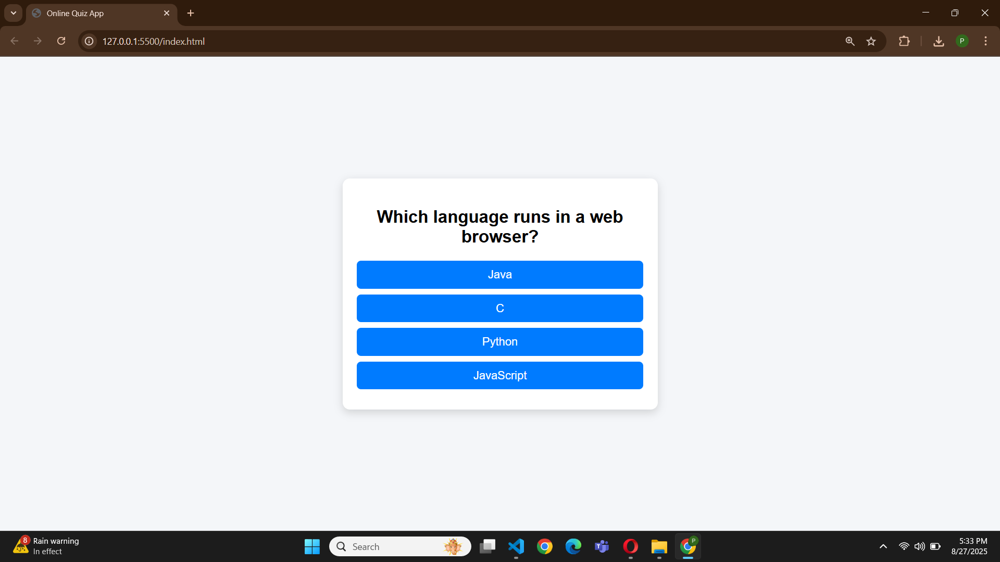

# 🧠 Online Quiz App

A simple and interactive **Quiz Application** built with **HTML, CSS, and JavaScript**.  
It features multiple-choice questions, score tracking, and a play-again option.  

---

## 🚀 Features
- Clean and responsive UI  
- Multiple-choice questions  
- Highlights correct/incorrect answers 
- Keeps track of score  
- Restart option after finishing  

---

## 📸 Screenshots





---

## 🎥 Demo Video


  


---

## 🛠️ Technologies Used
- **HTML5**
- **CSS3**
- **JavaScript **

---


   ```bash
   git clone https://github.com/YourUsername/quiz-app-html.git
